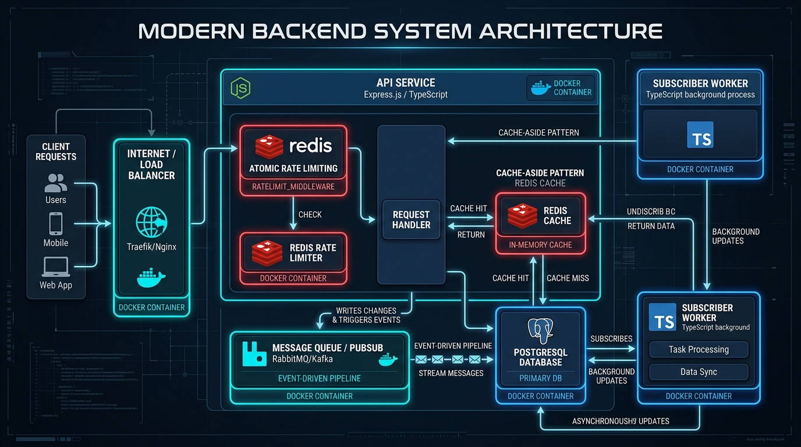

# Redis_Implementation

Backend implementation and practical concepts for Redis including Caching, Data Types, and Pub/Sub.



## Features
- **Redis Data Types**: Strings, Hashes, Lists, Sets, Sorted Sets
- **Caching**: Cache-aside pattern with Redis and PostgreSQL
- **Pub/Sub**: Redis Pub/Sub messaging and subscribers
- **Docker Compose**: Containerized Redis and PostgreSQL setup

## Getting Started

### Prerequisites
- Node.js (v18+)
- Docker & Docker Compose

### Setup
1. Copy `.env.example` to `.env`:
   ```bash
   cp .env.example .env
   ```
2. Start Redis and PostgreSQL using Docker:
   ```bash
   docker compose up -d
   ```
3. Install dependencies:
   ```bash
   npm install
   ```
4. Run migrations and seed data:
   ```bash
   npm run db:migrate
   npm run db:seed
   ```
5. Start development server:
   ```bash
   npm run dev
   ```

### Running Examples
- Redis Data Types: `npm run example:redis-types`
- Redis Caching: `npm run example:redis-caching`
- Redis Pub/Sub: `npm run example:redis-pub-sub`
- Notification Subscriber: `npm run subscriber`
